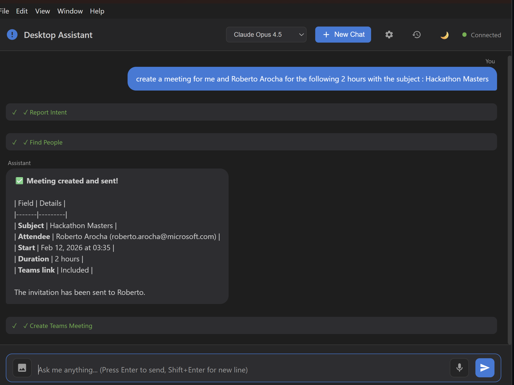
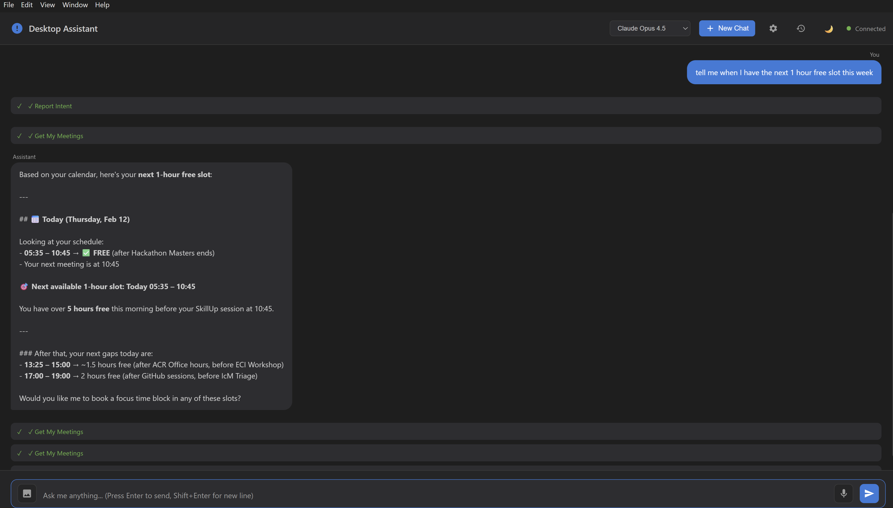
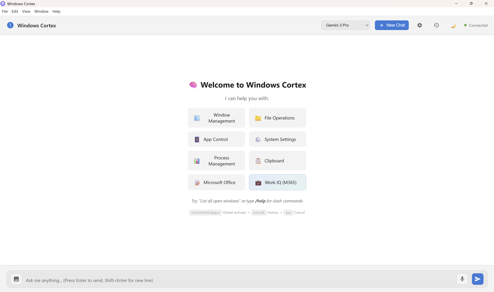
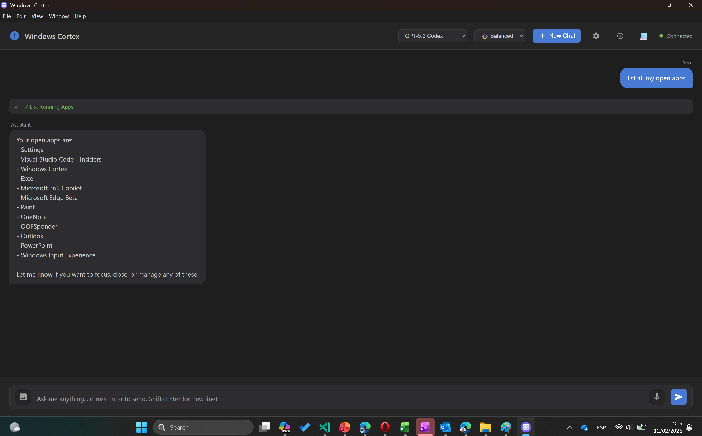
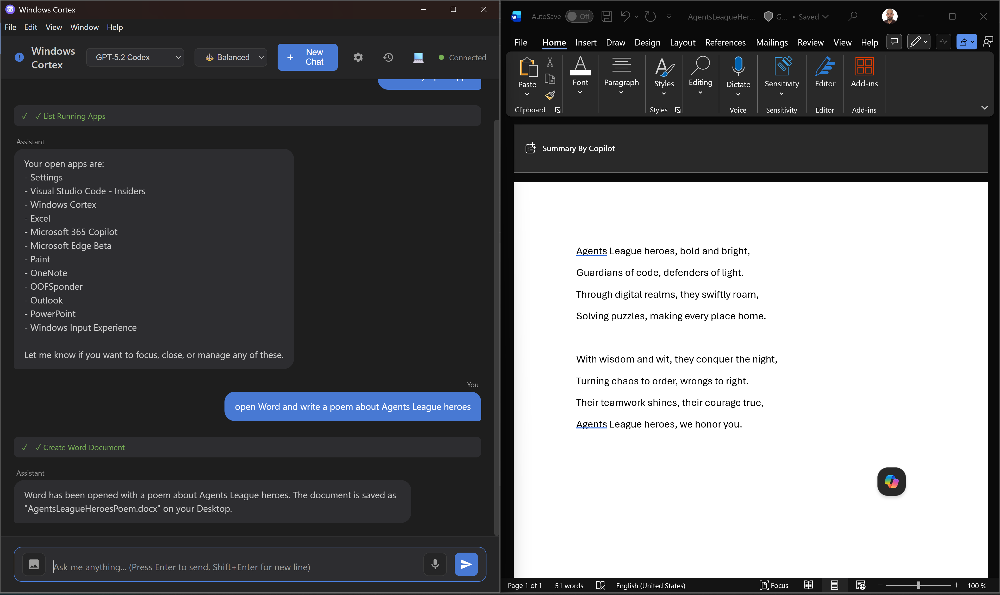
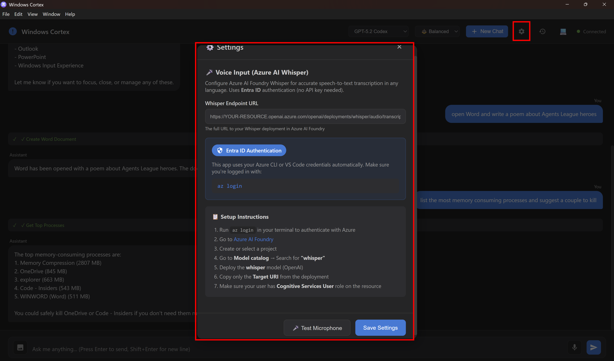
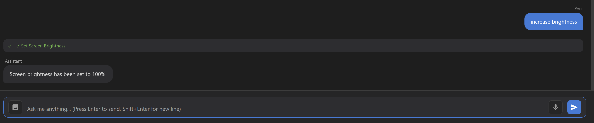
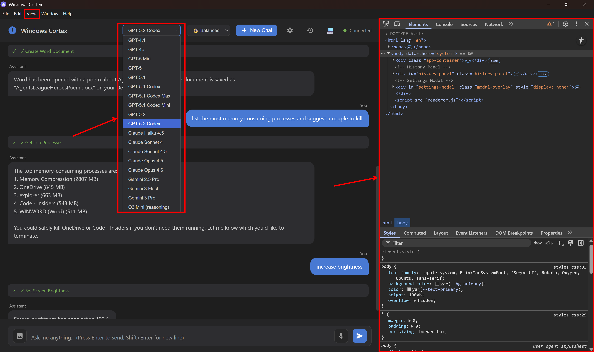

<p align="center">
  
</p>

<h1 align="center">🧠 Windows Cortex</h1>

<p align="center">
  <strong>Your AI-Powered Assistant for Windows</strong><br>
  Control your entire PC with natural language — powered by <a href="https://github.com/features/copilot">GitHub Copilot SDK</a>
</p>

<p align="center">
  <a href="#-features"></a>
  <a href="#-supported-models"></a>
  <a href="#"></a>
  <a href="#"></a>
  <a href="LICENSE"></a>
</p>

---

## 📸 Screenshots

<table>
  <tr>
    <td></td>
    <td></td>
  </tr>
  <tr>
    <td align="center"><em>Work IQ — Create or cancel meetings. Control Teams status.</em></td>
    <td align="center"><em>Work IQ — Find your next free slot with natural language</em></td>
  </tr>
  <tr>
    <td colspan="2" align="center"></td>
  </tr>
  <tr>
    <td colspan="2" align="center"><em>Dark and light mode</em></td>
  </tr>
  <tr>
    <td colspan="2" align="center"></td>
  </tr>
  <tr>
    <td colspan="2" align="center"><em>Apps Management — Launch, switch, maximize / minimize and control applications</em></td>
  </tr>
  <tr>
    <td colspan="2" align="center"></td>
  </tr>
  <tr>
    <td colspan="2" align="center"><em>Office Suite — Create Word, Excel, and PowerPoint documents with natural language</em></td>
  </tr>
  <tr>
    <td colspan="2" align="center"></td>
  </tr>
  <tr>
    <td colspan="2" align="center"><em>System Management — Monitor processes, resources, and system info</em></td>
  </tr>
  <tr>
    <td colspan="2" align="center"></td>
  </tr>
  <tr>
    <td colspan="2" align="center"><em>Accessibility — Hands-free control using voice input powered by Azure AI Whisper</em></td>
  </tr>
  <tr>
    <td colspan="2" align="center"></td>
  </tr>
  <tr>
    <td colspan="2" align="center"><em>System Settings — Control brightness, volume, and other system preferences</em></td>
  </tr>
  <tr>
    <td colspan="2" align="center"></td>
  </tr>
  <tr>
    <td colspan="2" align="center"><em>Dev Tools — Built-in developer tools for troubleshooting and 19+ AI models to choose from</em></td>
  </tr>
</table>

---

## ✨ What is Windows Cortex?

**Windows Cortex** is a native desktop application that gives you **AI superpowers** over your Windows PC. Just type (or speak) what you want to do in natural language, and the AI assistant will execute it for you using 60+ integrated tools.

It's like having a personal assistant that can:
- 📁 Manage your files and folders
- 🪟 Control your windows and applications
- 📧 Read and send emails from Outlook
- 📅 Create and cancel Teams meetings
- 📊 Generate Excel spreadsheets and PowerPoint presentations
- 🎤 Understand your voice commands
- 📸 Take and analyze screenshots
- ⚙️ Control system volume, brightness, and more
- 🔍 Search across your Microsoft 365 data

All from a single, beautiful chat interface.

---

## 🏗️ Architecture

```
┌──────────────────────────────────────────────────────┐
│                   Windows Cortex                      │
│  ┌──────────────────────────────────────────────┐    │
│  │              Electron Shell (v40)             │    │
│  │  ┌────────────────┐  ┌────────────────────┐  │    │
│  │  │   Renderer     │  │    Main Process     │  │    │
│  │  │  (Chat UI)     │◄─┤  (TypeScript)       │  │    │
│  │  │  HTML/CSS/JS   │  │                     │  │    │
│  │  └────────────────┘  └────────┬───────────┘  │    │
│  └───────────────────────────────┼──────────────┘    │
│                                  │                    │
│  ┌───────────────────────────────▼──────────────┐    │
│  │          GitHub Copilot SDK (v0.1.21)         │    │
│  │  ┌─────────┐ ┌──────────┐ ┌──────────────┐  │    │
│  │  │ Session │ │ Streaming│ │  Tool System  │  │    │
│  │  │ Manager │ │  Engine  │ │  (60+ tools)  │  │    │
│  │  └─────────┘ └──────────┘ └──────┬───────┘  │    │
│  └──────────────────────────────────┼───────────┘    │
│                                     │                 │
│  ┌──────────────────────────────────▼───────────┐    │
│  │              Tool Categories                  │    │
│  │  🪟 Windows  📁 Files    📱 Apps   ⚙️ System │    │
│  │  📊 Process  📋 Clipboard 📝 Office 💼 M365  │    │
│  └──────────────────────────────────────────────┘    │
│                                                       │
│  ┌──────────────────────────────────────────────┐    │
│  │           External Services                   │    │
│  │  🔑 Azure (Entra ID)  🎤 Azure AI Whisper    │    │
│  │  📊 Microsoft Graph   💼 Work IQ (MCP)       │    │
│  └──────────────────────────────────────────────┘    │
└──────────────────────────────────────────────────────┘
```

---

## 🤖 Supported Models

Windows Cortex leverages **GitHub Copilot** as its inference engine, giving you access to **19 frontier AI models**:

| Provider | Models |
|----------|--------|
| **OpenAI** | GPT-4.1, GPT-4o, GPT-5 Mini, GPT-5, GPT-5.1, GPT-5.1 Codex, GPT-5.1 Codex Max, GPT-5.1 Codex Mini, GPT-5.2, GPT-5.2 Codex, O3 Mini |
| **Anthropic** | Claude Haiku 4.5, Claude Sonnet 4, Claude Sonnet 4.5, Claude Opus 4.5, Claude Opus 4.6 |
| **Google** | Gemini 2.5 Pro, Gemini 3 Flash, Gemini 3 Pro |

> Switch models on-the-fly from the dropdown in the header. Reasoning models (O3, GPT-5.x) support adjustable reasoning effort (⚡ Fast / ⚖️ Balanced / 🧠 Deep).

---

## 🛠️ Complete Tool Reference (60+ Tools)

### 🪟 Window Management (6 tools)
| Tool | Description |
|------|-------------|
| `list_windows` | List all open windows with process names, titles, and handles |
| `focus_window` | Bring a window to the foreground by title |
| `close_window` | Close a window by title |
| `minimize_window` | Minimize a window |
| `maximize_window` | Maximize a window |
| `restore_window` | Restore a minimized/maximized window |

### 📁 File Operations (10 tools)
| Tool | Description |
|------|-------------|
| `list_files` | List files and folders (with optional recursive & pattern filter) |
| `search_files` | Search files by name or content |
| `move_file` | Move a file or folder |
| `copy_file` | Copy a file or folder |
| `delete_file` | Delete a file or folder |
| `rename_file` | Rename a file or folder |
| `create_folder` | Create new directories |
| `read_file` | Read file contents |
| `write_file` | Write or append to files |
| `get_file_info` | Get detailed file metadata |

### 📱 Application Control (5 tools)
| Tool | Description |
|------|-------------|
| `list_installed_apps` | List all installed applications |
| `list_running_apps` | List running applications with memory/CPU usage |
| `launch_app` | Launch an application by name or path |
| `quit_app` | Quit an application (graceful or force) |
| `switch_to_app` | Switch to an application (bring to foreground) |

### ⚙️ System Control (9 tools)
| Tool | Description |
|------|-------------|
| `get_system_volume` | Get current volume level and mute state |
| `set_system_volume` | Set volume level (0-100) and mute/unmute |
| `get_screen_brightness` | Get screen brightness level |
| `set_screen_brightness` | Set brightness (0-100) |
| `take_screenshot` | Capture full screen or active window |
| `toggle_do_not_disturb` | Toggle Focus Assist mode |
| `lock_screen` | Lock the computer |
| `sleep_computer` | Sleep or hibernate the PC |
| `get_system_info` | Detailed system info (OS, CPU, RAM, disks, uptime) |

### 📊 Process Management (5 tools)
| Tool | Description |
|------|-------------|
| `list_processes` | List processes with sorting and filtering |
| `get_process_info` | Detailed info about a specific process |
| `kill_process` | Kill/terminate a process |
| `get_top_processes` | Top resource-consuming processes (CPU or memory) |
| `get_system_resource_usage` | Overall CPU, memory, and disk usage |

### 📋 Clipboard (4 tools)
| Tool | Description |
|------|-------------|
| `read_clipboard` | Read clipboard (text, HTML, or file list) |
| `write_clipboard` | Write to clipboard |
| `clear_clipboard` | Clear clipboard contents |
| `get_clipboard_formats` | List available clipboard formats |

### 📝 Microsoft Office & Teams (10 tools)
| Tool | Description |
|------|-------------|
| `create_word_document` | Create Word documents with content |
| `create_excel_document` | Create Excel spreadsheets with data |
| `create_powerpoint_presentation` | Create PowerPoint presentations with slides |
| `create_outlook_email` | Create and send emails via Outlook |
| `create_teams_meeting` | Create Teams meetings with attendees |
| `cancel_meeting` | Cancel meetings and notify attendees |
| `create_calendar_event` | Create personal calendar events |
| `open_office_document` | Open any Office document |
| `set_teams_status` | Change Teams presence (Available, Busy, DND, etc.) |
| `get_teams_status` | Get current Teams status |

### 💼 Microsoft 365 / Work IQ (10 tools)
| Tool | Description |
|------|-------------|
| `get_my_meetings` | Get upcoming meetings from M365 calendar |
| `get_meeting_details` | Get detailed meeting info (attendees, agenda) |
| `get_my_emails` | Search and retrieve emails |
| `get_email_summary` | Summarize email threads on a topic |
| `get_my_documents` | Find documents in OneDrive/SharePoint |
| `get_teams_messages` | Get Teams channel/chat messages |
| `summarize_teams_channel` | Summarize channel activity |
| `find_people` | Find people and org chart info |
| `ask_workiq` | Natural language query across all M365 data |
| `get_work_summary` | Daily/weekly work activity summary |

---

## 🎤 Voice Input

Windows Cortex supports **voice commands** via Azure AI Whisper:

- Click the 🎤 microphone button or configure in Settings
- Speaks any language — Whisper transcribes with high accuracy
- Uses **Entra ID authentication** (no API keys needed)
- Auto-sends the transcribed message

> Requires an Azure AI Foundry deployment of the Whisper model. See Settings for setup instructions.

---

## 📸 Vision / Screenshot Analysis

Attach images to your messages for visual analysis:

- **📸 Screenshot button** — captures your screen instantly
- **📎 Drag & drop** — drop images directly into the chat
- **📋 Paste** — paste images from clipboard (`Ctrl+V`)
- AI analyzes the image and responds contextually

---

## ⌨️ Keyboard Shortcuts

| Shortcut | Action |
|----------|--------|
| `Ctrl+Shift+Space` | Global activate (works from any app) |
| `Ctrl+H` | Toggle chat history |
| `Ctrl+Shift+N` | New chat |
| `Ctrl+,` | Open settings |
| `Enter` | Send message |
| `Shift+Enter` | New line |
| `Esc` | Cancel current operation |

---

## ⚡ Slash Commands

Type these quick commands for instant actions:

| Command | Action |
|---------|--------|
| `/meetings` | Show today's meetings |
| `/emails` | Show unread emails |
| `/system` | Show system information |
| `/screenshot` | Take a screenshot |
| `/windows` | List open windows |
| `/apps` | List running apps |
| `/files` | List files in current directory |
| `/clipboard` | Show clipboard contents |
| `/help` | Show all commands |

---

## 🎨 Features

- 🌗 **Dark / Light / System theme** — seamlessly switch between themes
- 💬 **Streaming responses** — see the AI thinking in real-time
- 🔧 **Tool execution indicators** — see which tools the AI is using
- 📝 **Chat history** — persistent conversations across sessions
- 🔄 **Auto-retry & session recovery** — handles connection drops gracefully
- 📌 **System tray** — quick access from the notification area
- 🖱️ **Drag & drop images** — attach images by dragging into the chat
- ✅ **User confirmation dialogs** — approve sensitive operations before execution
- 🎯 **Configurable reasoning effort** — control how deep the AI thinks

---

## 🚀 Getting Started

### Prerequisites

- **Node.js** 18+ and **npm**
- **GitHub Copilot** subscription (Individual, Business, or Enterprise)
- **Windows 10/11** with Microsoft Office installed (for Office tools)
- **Azure CLI** (optional, for voice input and Teams status features)

### Installation

```bash
# Clone the repository
git clone https://github.com/jrubiosainz/windows-cortex.git
cd windows-cortex

# Install dependencies
npm install

# Run the app
npm run start
```

### Build Portable Executable

```bash
# Build a portable .exe
npm run dist:portable
```

---

## ⚙️ Configuration

### Voice Input (Azure AI Whisper)

1. Run `az login` to authenticate with Azure
2. Deploy a **Whisper** model in [Azure AI Foundry](https://ai.azure.com)
3. Copy the **Target URI** from the deployment
4. Paste it in **Settings → Whisper Endpoint URL**
5. Ensure your user has the `Cognitive Services User` role

### Teams Status Control

Requires Azure CLI authentication:
```bash
az login
```

### Microsoft 365 Integration (Work IQ)

Install Work IQ globally:
```bash
npm install -g @microsoft/workiq
```

---

## 🧰 Tech Stack

| Technology | Purpose |
|------------|---------|
| [Electron 40](https://www.electronjs.org/) | Desktop application framework |
| [GitHub Copilot SDK](https://www.npmjs.com/package/@github/copilot-sdk) | AI inference engine (v0.1.21) |
| [TypeScript](https://www.typescriptlang.org/) | Type-safe application logic |
| [esbuild](https://esbuild.github.io/) | Ultra-fast bundler |
| [Azure Identity](https://www.npmjs.com/package/@azure/identity) | Entra ID authentication |
| [Work IQ](https://www.npmjs.com/package/@microsoft/workiq) | Microsoft 365 data access via MCP |
| [Zod](https://zod.dev/) | Schema validation for tool parameters |
| PowerShell | Windows system automation |
| Microsoft Graph API | Teams presence control |

---

## 📂 Project Structure

```
windows-cortex/
├── src/
│   ├── main.ts                 # Electron main process & Copilot integration
│   └── tools/
│       ├── index.ts            # Tool aggregator
│       ├── windows-tools.ts    # Window management (6 tools)
│       ├── file-tools.ts       # File operations (10 tools)
│       ├── app-tools.ts        # Application control (5 tools)
│       ├── system-tools.ts     # System control (9 tools)
│       ├── process-tools.ts    # Process management (5 tools)
│       ├── clipboard-tools.ts  # Clipboard operations (4 tools)
│       ├── office-tools.ts     # Office & Teams (10 tools)
│       └── workiq-tools.ts     # Microsoft 365 / Work IQ (10 tools)
├── renderer/
│   ├── index.html              # Main UI
│   ├── renderer.js             # Frontend logic
│   └── styles.css              # Theming & styles
├── screenshots/                # Demo screenshots & video
├── build.mjs                   # esbuild configuration
├── package.json
└── tsconfig.json
```

---

## 📄 License

This project is licensed under the **MIT License** — see the [LICENSE](LICENSE) file for details.

---

<p align="center">
  Built with ❤️ using <strong>GitHub Copilot SDK</strong> + <strong>Electron</strong>
</p>

<p align="center">
  <a href="https://github.com/jrubiosainz/windows-cortex">⭐ Star this repo</a> •
  <a href="https://github.com/jrubiosainz/windows-cortex/issues">🐛 Report Bug</a> •
  <a href="https://github.com/jrubiosainz/windows-cortex/issues">💡 Request Feature</a>
</p>
